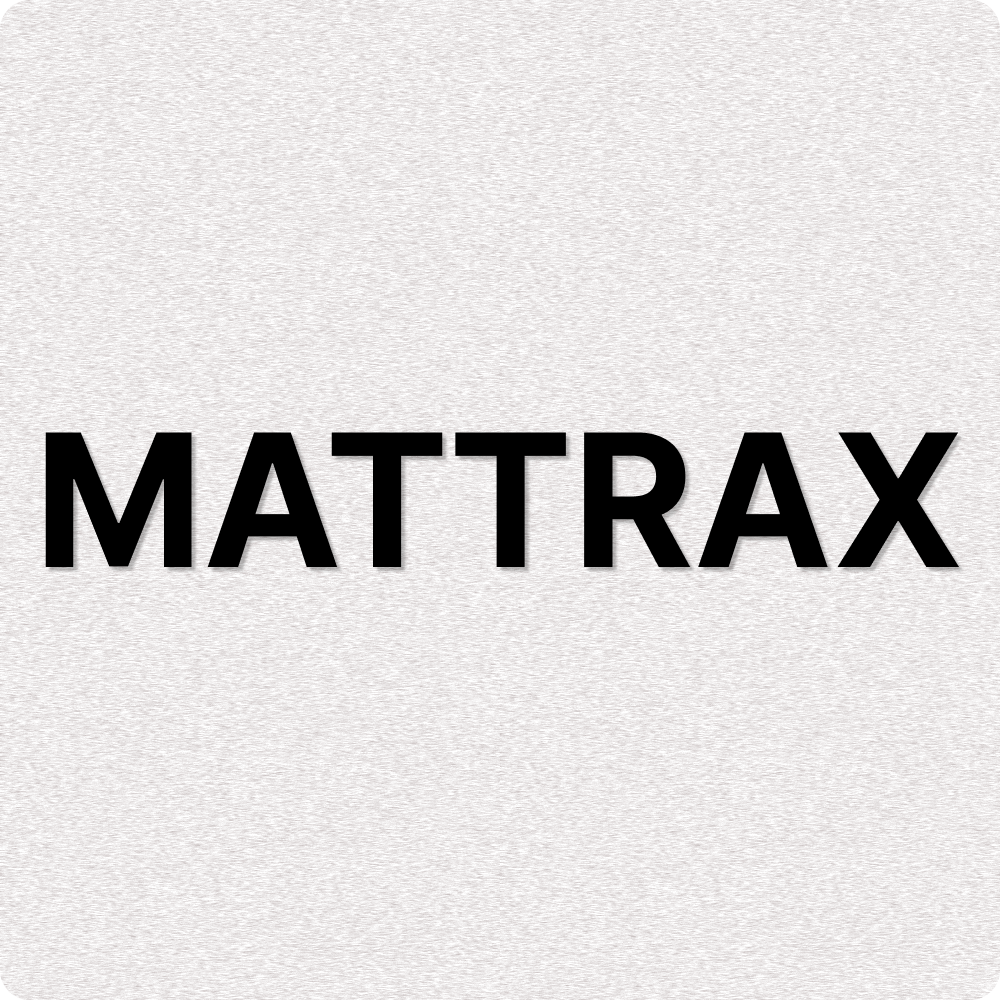

  

   
  

	

    Mattrax MDM is a full device management solution   for Windows, macOS, iOS, Android and Linux!
     
    <a href="https://mattrax.app"><strong>mattrax.app »</strong></a>
     
     
    <a href="https://discord.gg/WPBHmDSfAn">Discord</a>
    ·
    <a href="https://mattrax.app">Website</a>
    ·
    <a href="https://twitter.com/mattraxapp">Twitter</a>
  

Mattrax is no longer open source. We are working really hard and keeping the source code private means we can put our full focus on developing a robust MDM solution.

We are going to reconsider open sourcing it in the future!

This repository remains with the existing code from an earlier version.
